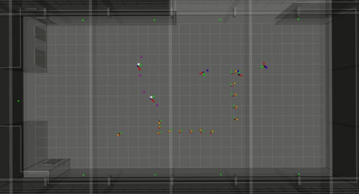

# atlas_config_example

## Overview

This is a configuration example for the the [ATLAS Real-Time Localization System (RTLS)](https://github.com/tudo-cni-atlas/atlas_rtls/).

### License

The source code of the localization is released under [BSD 3-Clause license](LICENSE).

**Authors:** Janis Tiemann, Yehya Elmasry

**Maintainer:** Janis Tiemann, janis.tiemann@tu-dortmund.de

**Affiliation:** Communication Networks Institute (CNI), TU Dortmund University

The atlas_config_example package has been tested under [ROS] Kinetic and Ubuntu 16.04. This is research code, expect that it changes often and any fitness for a particular purpose is disclaimed.

## Installation

### Building from Source

#### Dependencies

- [Robot Operating System (ROS)](http://wiki.ros.org) (middleware for robotics),
- [ATLAS RTLS](https://github.com/tudo-cni-atlas/atlas_rtls/)

#### Building

To build from source, clone the latest version from this repository into your catkin workspace and compile the package using

	cd catkin_workspace/src
	git clone https://github.com/tudo-cni-atlas/atlas_config_example.git
	cd ../
	catkin_make -j1

## Usage

Due to the modular nature and numerous configuration files that are required to run the ATLAS RTLS, multiple terminal instances is needed. An example is provided here:

Start a roscore:

	roscore

Load the required config files:

	roslaunch launch/config.launch

Start the ATALS core node (Taking the TOA messages and performing TDOA sample assembly):

	roslaunch launch/core.launch

Start the ATLAS localization node(s) (Taking the TDOA samples and calculating positions):

	roslaunch launch/localizer.launch

Start the ATLAS visualization node:

	roslaunch launch/visualizer.launch

Replaying the raw TOAs and ground-truth messages (Unzip the bags/2018-09-10-14-27-04.zip first and place it in the bags folder):

	rosbag play -s 35 bags/2018-09-10-14-27-04.bag

[ROS]: http://www.ros.org
[rviz]: http://wiki.ros.org/rviz
[Eigen]: http://eigen.tuxfamily.org